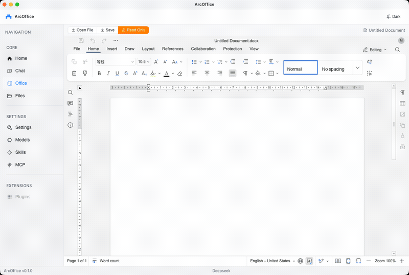

# ArcOffice


[](https://www.electronjs.org/)
[](https://vuejs.org/)
[](https://www.typescriptlang.org/)
[](https://vitejs.dev/)
[](https://biomejs.dev/)



A cross-platform desktop Office tool built with **Electron + Vue 3**.
Runs locally, privacy-first.

## Stack

**Core:** Electron / Vue 3 / TypeScript / Vite 6 / Element Plus / Pinia

**AI:** @anthropic-ai/sdk / MCP (Model Context Protocol) / markstream-vue

**Office:** OnlyOffice Web SDK / exceljs

**Tools:** Biome / sql.js

## Quick Start

```bash
pnpm install
pnpm electron:dev      # development
pnpm electron:build    # build + package
pnpm typecheck         # type check
pnpm lint              # lint
```

## License

[GPLv3](./LICENSE)
